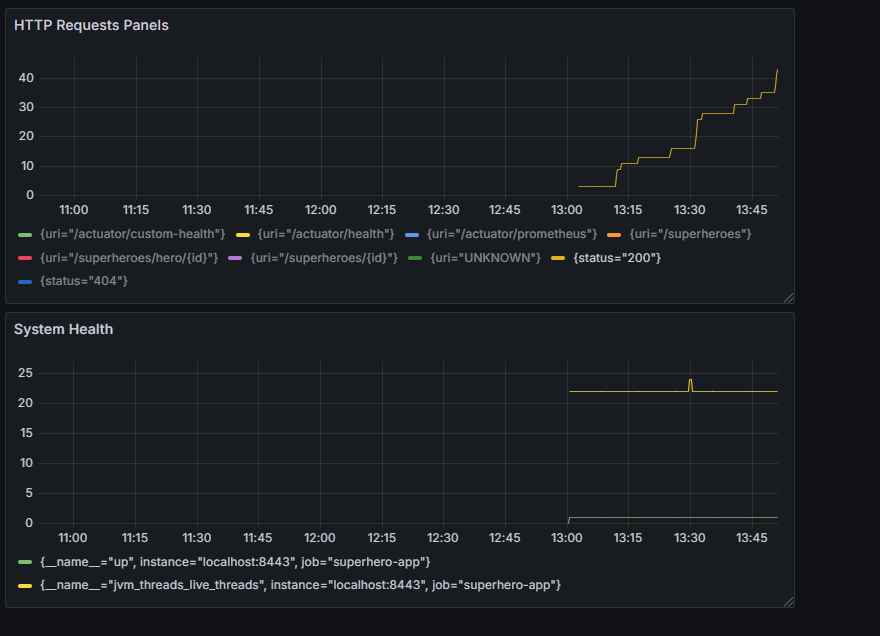

# Superhero API

Welcome to the Superhero API! This is a CRUD (Create, Read, Update, Delete) application that grants you access to a vast database of superheroes, their characteristics, and related information. 

## Table of Contents
- [Run Application](#run-application)
- [How to Use](#how-to-use)
- [Technologies and Features](#technologies-and-features)
- [Security](#security)
- [Credentials](#credentials)
- [Contact](#contact)

## Run Application
You have 2 options to run application:
1. **Using Docker**:
    - Pull the application Docker Image from the `juliparodi/apps` public repository with this command:
      ```bash
      docker pull juliparodi/superhero-app:latest
      ```
    - Then run it in detached mode on port 8443:
      ```bash
      docker run -d -p 8443:8443 juliparodi/superhero-app:latest
      ```
2. **Cloning the Repository**:
   - You can clone [superhero-repository](https://github.com/Juliparodi/super-hero-api) and:
     - Run it locally using your preferred IDE.
         - Create a JAR by executing:
           ```bash
           mvn package
           ```
         - This will create a JAR named "superhero.jar" in the `/target` folder. You can run it locally or on another server or computer by executing:
           ```bash
           java -jar superhero.jar
           ```

## How to Use

To get started with the Superhero API, follow these simple steps:

1. **Authentication**: Before using the API, you may need to log in using these [credentials](#credentials) for an JWT token which you will use to access resources. 
    Here is a step by step on how to do it:
    - Use /login endpoint provided by [Swagger](https://localhost:8443/swagger-ui/index.html).
    - Copy token provided in the response.
    - Paste it in "Authorize" section.
    - Congrats! You now can access resources depending on the user you login.
    
    For any issue please contact me at julianparodi19@gmail.com
2. **Making Requests**: Once application is running you can make requests to the API using standard HTTP methods (GET, POST, PUT, DELETE) from [Swagger](https://localhost:8443/swagger-ui/index.html).

3. **API Documentation**: SuperHero API is thoroughly documented using Swagger, a user-friendly interactive documentation tool. You can explore all available endpoints, request/response formats, and example requests by visiting our [Swagger Documentation](http://localhost:8443/swagger-ui/index.html). This is the best place to get detailed information on how to use our API effectively.

4. **Test**: The SuperHero API is thoroughly tested using a comprehensive suite of tests, including unit, functional, and integration tests. These tests are designed to ensure the reliability, functionality, and security of the API.
    - To run tests just execute in the root diretory
      - `mvn test`


## Technologies and Features

### Technologies Used

- **Programming Language**: [Java 25](https://docs.oracle.com/en/java/javase/25/docs/api/index.html)
- **Database**: [H2](http://h2database.com/html/main.html)
- **Web Framework**: [Spring Boot](https://spring.io/projects/spring-boot)
- **API Security**: [Spring Security](https://spring.io/projects/spring-security)
- **Authentication**: [JWT Token](https://jwt.io/)
- **Documentation**: [Swagger](https://swagger.io/)
- **Testing**: [JUnit](https://junit.org/), [MockMVC](https://docs.spring.io/spring-framework/reference/testing/spring-mvc-test-framework.html)
- **Deployment**: [Docker](https://www.docker.com/)
- **App version control**: [GIT](https://git-scm.com/)
- **DB version control**: [Flyway](https://flywaydb.org/)
- **Cache**: [Spring Cache](https://docs.spring.io/spring-boot/docs/current/reference/html/io.html)

### Tests
- **Tests Coverage**:
    - Jacoco: 90%
    - Mutation test: 88%

### Key Features

- **Superheroes Information**: Access detailed information about superheroes, including their names, description, birthDate, and more. You can also find a specific Hero by ID.
- **Search and Filters**: You don't have to know complete name of your favourite hero you can just put some text and it will be display all superheroes that their names contains that extract of text.
- **Create, update or delete a superhero**:  Only allowed to admin users.
- **Authentication**: Our resources are secured with JWT token, and passwords are encoding with BCrypt.
- **Interactive Documentation**: Explore API endpoints using our interactive Swagger documentation.

## Security

Security is a top priority for the Superhero API. We use industry-standard security practices to protect your data and ensure the confidentiality and integrity of your requests. All communication between clients and the backend is secured with HTTPS, so every request is encrypted in transit.

Authentication is handled using JWT (JSON Web Tokens). Only users with a valid token can access the API, and each token encodes the user’s role, which is used for authorization.

- GET resources: To retrieve superheroes or search results, you must authenticate and have the role of USER.

- POST, PUT, DELETE resources: To create, update, or delete superheroes, you must authenticate and have the role of ADMIN.

## Credentials

**Please take note that this is a TEST application, if this was supposed to be a production app you surely have to ask for this credentials to security team**

- User (to access only GET resources):
  - username: user
  - password: user123

- Admin (to access all resources):
  - username: admin
  - password: admin123

## Contact

For any inquiries, reporting errors, or providing advice on API improvements, please contact me at julianparodi19@gmail.com.

## Monitoring

Super Hero exposes metrics via Actuator at /actuator/prometheus. A Prometheus sidecar scrapes these metrics and exposes a route that can be used by Grafana dashboards. The dashboards visualize request rates, latency, errors, JVM health, and custom business metrics. Spring Security ensures only authorized access to sensitive endpoints while allowing monitoring. This setup provides secure, real-time insights into application performance and health.

